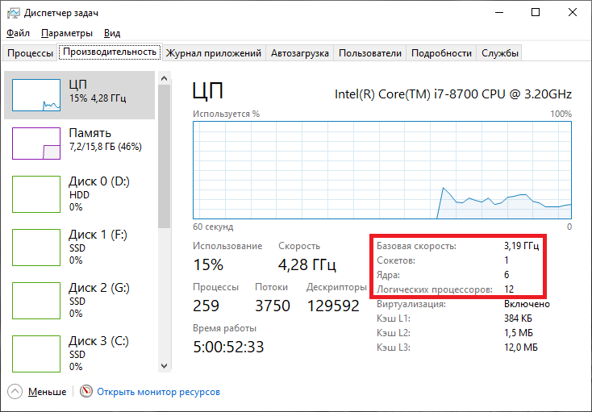

# Многопоточность и Thread Pool в C++
<!--->
Привет, Хабр! Я неожиданно созрел для написания первой статьи тут. За время работы в сфере IT у меня появилась своя собственная библиотека на языке C++, которая медленно, но верно обрастает различными полезными модулями. Не все включаемые в нее модули написаны мною с нуля, но я всегда стараюсь так или иначе адаптировать их под свои нужды. Сегодня у меня появилось непреодолимое желание поделиться с вами некоторыми фрагментами моей библиотеки.

## О чем и зачем эта статья?

Я давно заинтересовался темой многопоточной обработки, так как приходилось сталкиваться с ней во многих моих проектах. Я ни в коем случае не претендую на звание специалиста в этой области, лишь хочу поделиться своим опытом, поэтому, если я буду где-то неточен, то прошу понять, простить и направить. В рамках данной статьи я постараюсь грамотно и доходчиво осветить следующие аспекты:

1. Что такое параллельные вычисления, и когда это может пригодиться?
1. Понятие процесса и потока в операционной системе. Как распараллеливание реализует вычислительная машина?
1. Понятие пула потоков.
1. Запуск потоков на языке C++.
1. Проблема синхронизации потоков в C++.
1. Реализация пула потоков на языке C++.

Дело в том, что, изучая многопоточность, мне пришлось "облазить" кучу ресурсов для того, чтобы найти решения обозначенных выше проблем. Поэтому здесь я поставил перед собой задачу собрать все воедино. Я очень надеюсь, что это у меня получится, и эта статья облегчит кому-нибудь жизнь.
<--->
## Что такое распараллеливание?

**Параллельные вычисления** — это тип вычислений, при котором одновременно выполняется множество операций или процессов. Большие проблемы часто можно разделить на более мелкие, которые затем могут быть решены одновременно, и, как следствие, большая проблема будет решена при таком подходе гораздо быстрее.

Для того, чтобы более точно понять, о чем идет речь, я приведу каламбурный пример из повседневной жизни.

> Представьте себя в продуктовом магазине, с огромной тележкой продуктов, стоящего в не менее огромной очереди перед единственной работающей продавщицей. Каждый участник этого затора разгневанно будет требовать открыть дополнительную кассу и при этом совершенно очевидно окажется прав в том, что затор таким образом "рассосется" в два раза быстрее.

Однако, распараллеливанию могут быть подвержены не все задачи. Здесь вспомните свойство атома, как неделимой частицы. Некоторые задачи представляют из себя простейшие элементарные операции, а некоторые даже и не требует распараллеливания, так как выполняются редко и за приемлемое время.

## Как это устроено в компьютере? Процессы и потоки

Информацию для данного раздела частично была взята [тут](https://codernet.ru/articles/drugoe/potok_i_proczessyi_v_operaczionnoj_sisteme_proczessore_i_programmirovanii/) и [тут](https://pyatilistnik.org/difference-between-physical-cores-and-logical-processors/). По существу, для ознакомления можно выделить следующее:

+ **Процесс** на компьютере — это любое отдельно запущенное приложение. Например, открытый браузер, антивирусная программа, Skype и др. — все это отдельные процессы на компьютере.
+ Каждый отдельный процесс способен существовать отдельно друг от друга в том смысле, что независимо потребляет ресурсы устройства — оперативная память и время процессора.
+ Один процесс может порождать несколько **потоков (Threads)**, которые будут выполняться одновременно и параллельно. Важно отметить, что все потоки одного процесса будут исполнять отдельные части кода одной программы, деля между собой общие ресурсы, выделенные процессу.
+ Современные компьютеры имеют продвинутые процессоры, у которых есть по несколько ядер. Каждое отдельное ядро способно обработать минимум один поток. Раньше было так: одно ядро имело один ядерный поток, а один поток — это выполнение одной команды. Теперь научились делать ядра многопоточными, а это означает, что одно ядро может одновременно выполнять несколько команд в соответствии с числом **ядерных потоков**. Грубо говоря, если в одном ядре 4 ядерных потока, то ядро может выполнить одновременно 4 команды.

Вы можете легко узнать количество логических процессоров (что соответствует числу потоков, обрабатываемых одновременно), доступных на вашем компьютере. В операционной системе Windows 10 достаточно открыть "Диспетчер задач" и выбрать вкладку "ЦП" в разделе "Производительность". На скриншоте ниже представлена конфигурация моего ПК: 1 физический 6-ти ядерный процессор, каждое ядро имеет по 2 ядерных потока, и того мне доступно 12 ядерных потоков (логических процессоров) всего.



В заключение данного раздела, признаюсь, что я вас немножко обманул. На самом деле слово **"одновременно"** всюду в этой статье стоит заменить на **"условно одновременно"**. По-настоящему "одновременно" могут производить операции только ядра процессора, так как они на физическом уровне представляют из себя раздельные устройства.

Обратите еще раз внимание на скриншот, представленный выше. Запущено 259 процессов, каждый из них порождает как минимум 1 поток (основной для приложения). Как же 6-ти ядерный процессор справляется с таким количеством задач?

Дело в том, что поток является плодом довольно сложной абстракции. Ядро процессора в каждый такт работы выполняет строго одну операцию, а поддерживать многозадачность удается средствами операционной системы. Это происходит примерно следующим образом ("на пальцах"): каждое ядро процессора выполняет "кусочек" строго одного потока, затем "замораживает" его, переходя к другому и так далее происходит по циклу. Человеку незаметны моменты "заморозки", так как эти интервалы времени очень малы (если процессор слабый, то эффект "заморозки" проявляется в виде подтормаживаний или долгих загрузок). При этом ОС умеет управлять процессами достаточно эффективно, расставляя приоритеты при распределении времени процессора на активную работу запущенных потоков.

Этот факт стоит иметь ввиду, так как использование многопоточности не всегда будет ускорять приложение в число раз, равное количеству используемых им потоков.

## Что такое Thread Pool?

**Пул потоков (Thread Pool)** — это фиксированный набор потоков, одновременно выполняющих независимые друг от друга задачи, помещенные в некоторый массив. Массив задач обычно представляется в виде **очереди (Task Queue)**.


Основное назначение пула потоков — обратить "сырую" многопоточную обработку в удобный инструмент эффективного решения трудоемких задач, допускающих разбиение на независимые кусочки.

Ключевым аспектом логики работы Thread Pool'а является факт того, что все потоки запускаются **единожды**. Это означает, что исключается сценарий:

> 1. В очередь задач поступает новый элемент.
> 1. Под вновь прибывшую задачу создается поток, который достает ее из очереди и начинает выполнять.
> 1. По окончании работы над задачей поток уничтожается.

Правильным сценарием в данном случае будет следующий:

> 1. В очередь задач поступает новый элемент.
> 1. Задолго до этого уже созданы все потоки, находящиеся на данный момент в режиме ожидания. Вновь прибывшую задачу достает любой свободный поток из пула и начинает ее выполнять.
> 1. По окончании работы над задачей поток снова переходит в режим ожидания.

Именно этот аспект создает основную сложность реализации и требует знания многих инструментов языка программирования. Данный подход позволяет повысить производительность программы, так как запуск нового потока считается достаточно трудоемкой операцией.

## Запускаем простейшие потоки с помощью C++

Прежде чем, переходить непосредственно к реализации пула потоков, я хочу познакомить вас с некоторыми исходными возможностями языка программирования C++, связанными с использованием тех самых ядерных потоков (которые в ядрах процессора).

Для работы с потоками нам пригодится класс `std::thread`, определенный в заголовочном файле `<thread>`.

```
#include <iostream>
#include <thread>
#include <chrono>

void sleep(int duration) {
	// simulate expensive operation
	std::this_thread::sleep_for(std::chrono::seconds(duration));
}

int main() {
	std::cout << "starting first thread...\n";
	std::thread th1(sleep, 1);

	std::cout << "starting second thread...\n";
	std::thread th2(sleep, 2);

	std::cout << "waiting for threads to finish...\n";

	th1.join();
	std::cout << "the first thread finished\n";

	th2.join();
	std::cout << "the second thread finished\n";

	std::cout << "done\n";

	return 0;
}
```

Пример, приведенный выше, демонстрирует, как конструктор объекта `std::thread` принимает в качестве аргументов функцию и параметров ее вызова. При этом поток тут же начинает выполнять инструкции, описанные в теле инициализирующей его функции. Для того, чтобы "дождаться" завершения работы потока (выхода из переданной ему функции) используется метод `std::thread::join()`. Также, стоит отметить, что вместо `std::thread::join()` может быть использован метод `std::thread::detach()`, но в рамках этой статьи данная альтернатива рассмотрена не будет.

## Синхронизация потоков

Итак, запускать простейшие потоки мы научились. А что если два различных потока будут использовать общий ресурс?

```
#include <iostream>
#include <thread>
#include <chrono>

void func(int a) {
	for (int i = 0; i < 3; i++) {
		std::cout << a + i;
		std::this_thread::sleep_for(std::chrono::seconds(1));
		std::cout << " ";
	}
	std::cout << "\n";
}

int main() {

	std::thread th1(func, 1);
	std::thread th2(func, 4);

	th1.join();
	th2.join();

	return 0;
}
```

Вот незадача, запустив приведенный выше пример несколько раз, вы сможете убедиться, что при наличии общего ресурса (здесь поток вывода `std::cout`) результат работы программы может вести себя непредсказуемо. Неконтролируемый общий доступ потоков к более сложным структурам данных может привести к более серьезным последствиям (ошибки, исключения).

Тут в игру вступает **синхронизация потоков**. Для этого язык C++ предоставляет инструментарий в виде атомарных типов (шаблон std::atomic, определенный в `<atomic>`) и мьютексов (класс `std::mutex`, определенный в `<mutex>`). Задача этих инструментов — временно блокировать (когда это необходимо) общие для потоков объекты и фрагменты кода, предоставляя доступ к данным ресурсам только одному потоку (который первым добрался до них), обеспечивая таким образом **потокобезопасность**. Так, например объект любой доступной реализации шаблона `std::atomic` может быть безопасно единовременно считываться и изменяться несколькими потоками.

Попробуем "починить" предыдущий пример при помощи внедрения общего для потоков мьютекса `std::mutex mtx`.

```
#include <iostream>
#include <thread>
#include <chrono>
#include <mutex>

std::mutex mtx;

void func(int a) {
	mtx.lock();
	for (int i = 0; i < 3; i++) {
		std::cout << a + i;
		std::this_thread::sleep_for(std::chrono::seconds(1));
		std::cout << " ";
	}
	std::cout << "\n";
	mtx.unlock();
}

int main() {

	std::thread th1(func, 1);
	std::thread th2(func, 4);

	th1.join();
	th2.join();

	return 0;
}
```

Да, результат все равно неоднозначен, так как нельзя предсказать, какой из двух потоков получит к защищенному фрагменту кода доступ первее, но все же удалось добиться последовательного и безопасного вывода в консоль.

Я надеюсь, из примера интуитивно понятно, как и для чего используются мьютексы. Более детально разобраться с проблемой синхронизации потоков я предлагаю вам самим. Я лишь в дополнение упомяну некоторые полезные шаблоны и классы, которые используются для более гибкого управления мьютексами, а также участвуют в моей реализации Thread Pool'а:

+ `std::lock_guard` || `<mutex>` || Блокирует "захваченный" мьютекс до тех пор, пока не будет уничтожен.
+ `std::unique_lock` || `<mutex>` || Расширяет функционал "захваченного" мьютекса, а также используется в связке с `std::condition_variable`.
+ `std::scoped_lock` || `<mutex>` || Похож на `std::lock_guard`, но умеет "захватывать" несколько мьютексов одновременно, предотвращая при этом взаимную блокировку (deadlock).
+ `std::condition_variable` || `<condition_variable>` || Переменная этого класса блокирует один или несколько потоков до тех пор, пока другой поток не уведомит о снятии блокировки данную переменную. "Захватывает" объект `std::unique_lock<std::mutex>`.

На данный момент, возможно, многое осталось непонятным, но не все сразу. Я в свое время угробил уйму человеко-часов на познание истины. В данном параграфе я скорее ставил себе задачу "подсветить" как можно больше вопросов, требующих отдельного изучения, чем написать пособие.

## Реализация пула потоков на языке C++

Читаю Хабр я уже довольно давно, и в период становления меня "повелителем потоков" я наткнулся на соответствующую [статью](https://habr.com/ru/articles/656515). Признаюсь честно, за основу своего Thread Pool'а я взял реализацию, представленную именно там ([базовая реализация](https://github.com/YFatMR/Habr/blob/main/thread_pool/best_version.cpp)).

В рамках адаптации и модификации позаимствованных идей, я поставил перед собой следующие задачи:

1. Создать удобный интерфейс взаимодействия пользователя с пулом потоков, разработав при этом достойный формат отдаваемых пулу заданий.
1. Реализовать безопасное двустороннее взаимодействие Thread Pool'а с обрабатываемыми задачами и решить проблему поиска "редкого успеха".

С первым пунктом, вроде, все ясно, поэтому сразу прокомментирую пункт под номером два. Под "редким успехом" следует понимать "иголку в стоге сена". Проведем параллель с многопоточной обработкой.

> Представьте себе, как несколько товарищей безуспешно, но бережно перебирают соломинку за соломинкой, находя в каждой из них кажущиеся сходства с заветной иголочкой. Спустя несколько часов кропотливых поисков один из друзей находит "стальную беглянку". Работа выполнена, успех получен, далее продолжать нет необходимости, всем прекратить мучения!

Ну а если серьезно, пул потоков должен понимать, когда следует остановиться. Пользователь должен иметь возможность гибкой настройки условий, при котором пулу подается соответствующий сигнал.

Любую задачу, поступающую на обработку Thread Pool'ом я предлагаю объявлять наследником абстрактного класса Task:

```
namespace MT {
	typedef unsigned long long int task_id;

	// абстрактный класс задачи
	class Task {
		friend class ThreadPool;
	public:
		enum class TaskStatus {
			awaiting,
			completed
		};

		Task(const std::string& _description);

		// метод для подачи сигнала пулу из текущей задачи
		void send_signal();

		// абстрактный метод, который должен быть реализован пользователем,
		// в теле этой функции должен находиться тракт решения текущей задачи
		void virtual one_thread_method() = 0;

	protected:
		MT::Task::TaskStatus status;
		// текстовое описание задачи (нужно для красивого логирования)
		std::string description;
		// уникальный идентификатор задачи
		MT::task_id id;

		MT::ThreadPool* thread_pool;

		// метод, запускаемый потоком
		void one_thread_pre_method();
	};
}
```

Данный подход имеет как преимущества, так и недостатки.

Плюсы:

+ Объект задачи уже внутри себя содержит все необходимые ресурсы для ее решения, а потокам пула достаточно лишь вызвать метод `Task::one_thread_pre_method()`, не принимающий никаких лишних аргументов и не возвращающий значений.
+ В силу наличия свойства абстрактности у `Task`, запрещено создавать "бесполезные" объекты данного класса.
+ Многие реализации в качестве задачи используют шаблонные функции с произвольным числом аргументов вида `template <typename FuncRetType, typename ...Args, typename ...FuncTypes> Task(FuncRetType(*func)(FuncTypes...), Args&&... args)`, что влечет за собой "протягивание" кучи параметров и подвергает проект более тяжелой отладке. В моем случае простейшие, но незаметные ошибки при создании задач будут обнаружены в момент вызова конструктора класса задачи на этапе написания кода, а не на этапе компиляции.

Минусы:

+ Под каждый отдельный вид задачи нужно объявлять целый класс. Это может оказаться более громоздким, чем написание новой функции.
+ От пользователя требуется владение навыками объектно-ориентированного программирования. Никто не отменял различные проблемы, связанные с наследованием и множественным наследованием.

Класс `ThreadPool` реализует непосредственно пул потоков:

```
namespace MT {
    // простая обертка над std::thread для того, что бы отслеживать
	// состояние каждого потока
	struct Thread {
		std::thread _thread;
		std::atomic<bool> is_working;
	};

	class ThreadPool {

		friend void MT::Task::send_signal();

	public:
		ThreadPool(int count_of_threads);

		// шаблонная функция добавления задачи в очередь
		template <typename TaskChild>
		MT::task_id add_task(const TaskChild& task);

		// ожидание полной обработки текущей очереди задач или приостановки,
		// возвращает id задачи, которая первая подала сигнал и 0 иначе
		MT::task_id wait_signal();

		// ожидание полной обработки текущей очереди задач, игнорируя любые
		// сигналы о приостановке
		void wait();

		// приостановка обработки
		void stop();

		// возобновление обработки
		void start();

		// получение результата по id
		template <typename TaskChild>
		std::shared_ptr<TaskChild> get_result(MT::task_id id);

		// очистка завершенных задач
		void clear_completed();

		// установка флага логирования
		void set_logger_flag(bool flag);

		~ThreadPool();

	private:
		// мьютексы, блокирующие очереди для потокобезопасного обращения
		std::mutex task_queue_mutex;
		std::mutex completed_tasks_mutex;
		std::mutex signal_queue_mutex;

		// мьютекс, блокирующий логер для последовательного вывода
		std::mutex logger_mutex;

		// мьютекс, блокирующий функции ожидающие результаты (методы wait*)
		std::mutex wait_mutex;

		std::condition_variable tasks_access;
		std::condition_variable wait_access;

		// набор доступных потоков
		std::vector<MT::Thread*> threads;

		// очередь задач
		std::queue<std::shared_ptr<Task>> task_queue;
		MT::task_id last_task_id;

		// массив выполненных задач в виде хэш-таблицы
		std::unordered_map<MT::task_id, std::shared_ptr<Task>> completed_tasks;
		unsigned long long completed_task_count;

		std::queue<task_id> signal_queue;

		// флаг остановки работы пула
		std::atomic<bool> stopped;
		// флаг приостановки работы
		std::atomic<bool> paused;
		std::atomic<bool> ignore_signals;
		// флаг, разрешающий логирования
		std::atomic<bool> logger_flag;

		Timer timer;

		// основная функция, инициализирующая каждый поток
		void run(MT::Thread* thread);

		// приостановка обработки c выбросом сигнала
		void receive_signal(MT::task_id id);

		// разрешение запуска очередного потока
		bool run_allowed() const;

		// проверка выполнения всех задач из очереди
		bool is_comleted() const;

		// проверка, занятости хотя бы одного потока
		bool is_standby() const;
	};
}
```

Для хранения задач в очереди я использовал "умные" указатели `std::shared_ptr`. Это, в основном, необходимо для преобразования из дочернего класса задачи в базовый класс Task (upcasting) при добавлении в очередь и обратно (downcasting) при выгрузке результата ("игра на понижение" при приведении типов звучит опасно и "костыльно", но работает).

Решенные задачи по окончании обработки сохраняются в хеш-таблице `ThreadPool::completed_tasks`. Такой вариант был выбран из соображений быстрого поиска по идентификатору.

Атрибут `ThreadPool::timer` — это объект вспомогательного класса `Timer` для логирования. Отношения к рассматриваемой задаче он не имеет, поэтому углубляться в его реализацию я не буду. Все, что он делает, это вычисляет временные интервалы и "красиво" выводит текущее время.

Теперь перейдем к определению методов объявленных классов. С классом `Task` все предельно просто:

```
MT::Task::Task(const std::string& _description) {
	description = _description;
	id = 0;
	status = MT::Task::TaskStatus::awaiting;
	thread_pool = nullptr;
}

void MT::Task::send_signal() {
	thread_pool->receive_signal(id);
}

void MT::Task::one_thread_pre_method() {
	one_thread_method();
	status = MT::Task::TaskStatus::completed;
}
```

Стоит отметить, что `Task::id` свою уникальность приобретает не в момент создания объекта, а в момент добавления в очередь задач (`ThreadPool::add_task`) и никак не контролируется пользователем. Также в момент добавления в очередь с текущей задачей будет связан обрабатывающий ее пул потоков (`Task::thread_pool` по умолчанию `nullptr`). Этот атрибут необходим для обратной связи с пулом, а именно для подачи сигналов о приостановке Thread Pool'у средствами метода `Task::send_signal()`.

Теперь поговорим об основном классе `ThreadPool`.

```
MT::ThreadPool::ThreadPool(int count_of_threads) {
	stopped = false;
	paused = true;
	logger_flag = false;
	last_task_id = 0;
	completed_task_count = 0;
	ignore_signals = true;
	for (int i = 0; i < count_of_threads; i++) {
		MT::Thread* th = new MT::Thread;
		th->_thread = std::thread{ &ThreadPool::run, this, th };
		th->is_working = false;
		threads.push_back(th);
	}
}
```

При инициализации, пул потоков находится в режиме ожидания (флаг `ThreadPool::paused` по умолчанию `true`).

Флаг `ThreadPool::stopped` должен быть неизменно в состоянии `false` вплоть до вызова деструктора. Он указывает на то, что пул потоков все еще "жив" и способен выполнять поступающие задачи.

Каждый поток запускается с вызовом закрытого метода `ThreadPool::run`, передавая указатель на самого себя для контроля состояния (управление флагом `Thread::is_working`):

```
bool MT::ThreadPool::run_allowed() const {
	return (!task_queue.empty() && !paused);
}

void MT::ThreadPool::run(MT::Thread* _thread) {
	while (!stopped) {
		std::unique_lock<std::mutex> lock(task_queue_mutex);

		// текущий поток находится в режиме ожидания в случае,
		// если нет заданий либо работа всего пула приостановлена
		_thread->is_working = false;
		tasks_access.wait(lock, [this]()->bool { return run_allowed() || stopped; });
		_thread->is_working = true;

		if (run_allowed()) {
			// поток достает задачу из очереди
			auto elem = std::move(task_queue.front());
			task_queue.pop();
			lock.unlock();

			if (logger_flag) {
				std::lock_guard<std::mutex> lg(logger_mutex);
				std::cout << timer.make_checkpoint("Run task " + elem->description) << std::endl;
			}
			// решение задачи
			elem->one_thread_pre_method();
			if (logger_flag) {
				std::lock_guard<std::mutex> lg(logger_mutex);
				std::cout << timer.make_checkpoint("End task " + elem->description) << std::endl;
			}

			// сохранение результата
			std::lock_guard<std::mutex> lg(completed_tasks_mutex);
			completed_tasks[elem->id] = elem;
			completed_task_count++;
		}
		// пробуждение потоков, которые находятся в ожидании пула (методы wait*)
		wait_access.notify_all();
	}
}
```

Тут скажу лишь пару слов об условной переменной `ThreadPool::wait_access`. В данном случае речь идет о пробуждении потоков, вызвавших такие методы, как `ThreadPool::wait()` и `ThreadPool::wait_signal()`, например, основной поток приложения с функцией `main`. Об этих методах чуть позже.

Как видно в реализации, решенная задача кладется в `ThreadPool::completed_tasks` в неизменном виде по ключу `Task::id`. Мною было решено не вводить излишних усложнений в виде дополнительных классов для сохранения результатов. Пользователь самостоятельно определит нужные ему ресурсы в дочернем классе задачи, которые будут изменены или заполнены при помощи переопределенного метода `Task::one_thread_method()`.

```
void MT::ThreadPool::start() {
	if (paused) {
		paused = false;
		// даем всем потокам разрешающий сигнал для доступа
		// к очереди невыполненных задач
		tasks_access.notify_all();
	}
}

void MT::ThreadPool::stop() {
	paused = true;
}

void MT::ThreadPool::receive_signal(MT::task_id id) {
	std::lock_guard<std::mutex> lock(signal_queue_mutex);
	signal_queue.emplace(id);
	if (!ignore_signals)
		stop();
}
```

Публичные методы `ThreadPool::start()` и `ThreadPool::stop()` нужны для приостановки и возобновления работы пула в том смысле, что устанавливают потоки в режим ожидания и наоборот (важно, что потоки не уничтожаются как объекты). Отдельный интерес представляет закрытый метод `ThreadPool::receive_signal(*)`, который предназначен для вызова только внутри дружественной функции `Task::send_signal()`. Этот механизм является важной составляющей при отлавливании "редкого успеха" в связке с методом `ThreadPool::wait_signal()`, о котором чуть позже.

Далее я продемонстрирую нехитрую реализацию метода для добавления новых задач в очередь на обработку:

```
template <typename TaskChild>
MT::task_id add_task(const TaskChild& task) {
    std::lock_guard<std::mutex> lock(task_queue_mutex);
    task_queue.push(std::make_shared<TaskChild>(task));
    // присваиваем уникальный id новой задаче
    // минимальное значение id равно 1
    task_queue.back()->id = ++last_task_id;
    // связываем задачу с текущим пулом
    task_queue.back()->thread_pool = this;
    tasks_access.notify_one();
    return last_task_id;
}
```

Стоит отметить, что на шаблонный тип `TaskChild` негласно накладывается требование быть дочерним классом базового класса Task. Также, здесь с помощью `tasks_access.notify_one()` посылается разрешающий сигнал одному из потоков (неважно какому), который "застрял" в соответствующем месте внутри функции `ThreadPool::run`.

Получить результаты можно по идентификатору задачи только в том случае, если она была решена и направлена в `ThreadPool::completed_tasks`:

```
template <typename TaskChild>
std::shared_ptr<TaskChild> get_result(MT::task_id id) {
    auto elem = completed_tasks.find(id);
    if (elem != completed_tasks.end())
        return std::reinterpret_pointer_cast<TaskChild>(elem->second);
    else
        return nullptr;
}
```

Для корректного преобразования типов внутри `ThreadPool::get_result`, необходимо заранее знать тип задачи. С одной стороны, это можно отнести к минусам реализации, с другой стороны, все задачи, поступающие на обработку, зачастую имеют один и тот же оговоренный ранее тип.

Наконец, переходим к основным методам, вызываемым ожидающими потоками:

```
bool MT::ThreadPool::is_comleted() const {
	return completed_task_count == last_task_id;
}

bool MT::ThreadPool::is_standby() const {
	if (!paused)
		return false;
	for (const auto& thread : threads)
		if (thread->is_working)
			return false;
	return true;
}

void MT::ThreadPool::wait() {
	std::lock_guard<std::mutex> lock_wait(wait_mutex);

	start();

	std::unique_lock<std::mutex> lock(task_queue_mutex);
	wait_access.wait(lock, [this]()->bool { return is_comleted(); });

	stop();
}

MT::task_id MT::ThreadPool::wait_signal() {
	std::lock_guard<std::mutex> lock_wait(wait_mutex);

	ignore_signals = false;

	signal_queue_mutex.lock();
	if (signal_queue.empty())
		start();
	else
		stop();
	signal_queue_mutex.unlock();

	std::unique_lock<std::mutex> lock(task_queue_mutex);
	wait_access.wait(lock, [this]()->bool { return is_comleted() || is_standby(); });

	ignore_signals = true;

	// на данный момент все задачи по id из
	// очереди signal_queue считаются выполненными
	std::lock_guard<std::mutex> lock_signals(signal_queue_mutex);
	if (signal_queue.empty())
		return 0;
	else {
		MT::task_id signal = std::move(signal_queue.front());
		signal_queue.pop();
		return signal;
	}
}
```

Метод `ThreadPool::wait()` позволяет дождаться выполнения всех текущих задач из очереди `ThreadPool::task_queue`, игнорируя сигналы об остановке. Особый интерес представляет метод `ThreadPool::wait_signal()`, который решает основную проблему поиска "редкого успеха". Этот метод в результате ставит обработку на паузу, дожидается истинности `ThreadPool::is_standby()` и возвращает идентификатор задачи, подавшей сигнал первее всех. При этом, если ни одного успеха не произошло, то возвращается `0`. Заметьте, что в случае наличия нескольких успехов, не произойдет их утери, так как соответствующие `id` будут занесены в специально подготовленную очередь `ThreadPool::signal_queue`.

Остались еще пару вспомогательных методов и деструктор:

```
void MT::ThreadPool::clear_completed() {
	std::scoped_lock lock(completed_tasks_mutex, signal_queue_mutex);
	completed_tasks.clear();
	while (!signal_queue.empty())
		signal_queue.pop();
}

void MT::ThreadPool::set_logger_flag(bool flag) {
	logger_flag = flag;
}

MT::ThreadPool::~ThreadPool() {
	stopped = true;
	tasks_access.notify_all();
	for (auto& thread : threads) {
		thread->_thread.join();
		delete thread;
	}
}
```

Метод `ThreadPool::clear_completed()` может пригодиться для того, чтобы не хранить ненужные результаты на протяжении всего времени жизни пула. Как я и обещал ранее, флаг `ThreadPool::stopped` становится `true` только в момент уничтожения пула. Собственно говоря, тут и происходит `std::thread::join()` каждого из потоков.

## Пример использования ThreadPool

А вот простенький пример использования моего пула в случае 3-х потоков. Для демонстрации задачи будут сигнализировать о "редком успехе" в случае, если на их решение будет затрачено много времени:

```
#include "thread_pool.h"

struct TestTask : public MT::Task {
	int duration;
	TestTask(const std::string& id, int _duration) : Task(id) {
		duration = _duration + ((rand() % 20));
		description += "_" + std::to_string(duration);
	};
	void one_thread_method() override {
		if (duration >= 10) {
			send_signal();
			return;
		}
		else
			std::this_thread::sleep_for(std::chrono::seconds(duration));
	}
};

int main() {

	MT::ThreadPool thread_pool(3);
	thread_pool.set_logger_flag(true);
	// снимаем пул с паузы, позволяя потокам браться за задачи налету
	thread_pool.start();
	for (int i = 0; i < 20; i++) {
		thread_pool.add_task(TestTask("TestTask_" + std::to_string(i + 1), 1));
	}
	// дождемся трех "редких успехов"
	for (int i = 0; i < 3; i++) {
		MT::task_id signal = thread_pool.wait_signal();
		if (signal != 0) {
			auto result = thread_pool.get_result<TestTask>(signal);
			std::cout << "id: " << signal << ", duration: " << result->duration << std::endl;
		}
	}

	return 0;
}
```
<!--->
## Заключение

Итак, мой монолог подошел к концу, и мне пора уходить. План статьи и поставленные задачи считаю выполненными.

Более детально с представленной реализацией вы сможете ознакомиться [тут](https://github.com/Dedulya07/ThreadPool). Реализация соответствует стандарту `std c++17`. Всем спасибо за внимание!
<--->